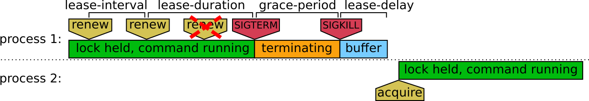

lock and run command
====================

This is a simple program that will acquire a lock (or "lease") before running a command, and will stop the command if it is lost.

The goal is to make sure only a single instance of a command is running at any given time, using a network-based locking mechanism where a lock can be lost.

In spirit, this is similar to [the flock shell command](https://www.man7.org/linux/man-pages/man1/flock.1.html), except that it uses remote services, and might terminate the command (UNIX locks cannot be "lost").

Timing
------

A lease is acquired every `lease-interval`. It is valid for `lease-duration`, after which lock-and-run will send a SIGTERM to the command, then a SIGKILL after `grace-period`. A different process can acquire the lease after an additional `lease-delay`.



* `lease-interval` default to 15 seconds, it is the duration between writes to the lease. Lowering this value will increase the amount of writes issued to the synchronization system.
* `lease-duration` defaults to 2 times `lease-interval`.
* `grace-period` defaults to 5 seconds. Increasing this value will make sure the command has time to finish, while making failover slower.
* `lease-delay` defaults to 2 seconds.

Example usage
-------------

Lock via a Kubernetes API object mynamespace/myprogram-lease:

```
$ lock-run-cmd k8s --kubeconfig=$KUBECONFIG --namespace=mynamespace --lease-object=myprogram-lease ./myprogram
```

Lock via ETCD:

```
$ lock-run-cmd etcd --endpoints=10.0.1.1:2379 --cacert=/etc/etcd/ca.crt --cert=/etc/etcd/client.crt --key=/etc/etcd/client.key --lease-key=/myprogram-lease ./myprogram
```

Lock via S3:

```
$ lock-run-cmd s3 --bucket=myprogram --object=myprogram-lease --lease-interval 60s ./myprogram
```
